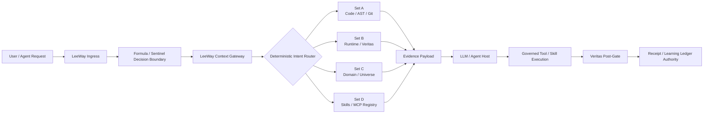

# LeeWay Remote MCP Context Gateway

**Status:** C3 supporting subgate — implementation branch; deployment remains unverified until an HTTP host executes and passes acceptance tests.

## Purpose

The LeeWay Context Gateway moves repetitive context discovery out of individual models. Instead of every LLM searching the same repository, runtime estate, receipts, and domain metadata, LeeWay deterministically maps intent to the minimum required evidence set and exposes that payload through one stable MCP endpoint.

This reduces **search debt**. It does **not** claim that every third-party host will invoke MCP before its own first inference. Compulsory zero-inference pre-routing is guaranteed only when the LeeWay ingress/harness controls the pre-model request path.

## Governed flow



The gateway itself does not fabricate Formula decisions, Veritas PASS states, receipts, or Learning Ledger updates. It consumes canonical evidence exports and preserves their status.

## Context systems

| System | Data set | Typical intents | Evidence source |
|---|---|---|---|
| A | Codebase AST & Git Diffs | edit, refactor, frontend, TypeScript, Luau, Git | `LEEWAY_SET_A_FILE` |
| B | Runtime Health & Veritas Evidence | Docker, runtime, health, receipt, SRE, deploy | `LEEWAY_SET_B_FILE` |
| C | Domain / Universe State | Roblox, universe, creator, asset, game world | `LEEWAY_SET_C_FILE` |
| D | MCP Skills & Capability Registry | MCP, skills, model, connector, gateway admin | `LEEWAY_SET_D_FILE` or skill-registry metadata |

If a source is not configured, the gateway returns `UNVERIFIED / NOT_CONFIGURED`. Missing state is never replaced with demo health values.

## HTTP surfaces

- `GET /` — administrative portal and connection topology.
- `POST/GET /mcp` — remote MCP endpoint, backed by the current MCP v2 server handler.
- `GET /healthz` — process health only; it does not claim Runtime Fabric or Veritas health.
- `GET /api/systems` — Set A/B/C/D evidence summaries.
- `GET /api/telemetry` — privacy-minimal observed connection metadata.
- `GET /api/context/route?intent=...` — deterministic context-routing API for LeeWay-controlled pre-model clients.
- `GET /api/admin/config` — protected configuration status; requires `Authorization: Bearer <LEEWAY_ADMIN_TOKEN>`.

## MCP primitives

### Tools

- `leeway_context_route` — route intent and return the assembled evidence payload.
- `leeway_gateway_status` — show observed gateway state.
- Existing enabled LeeWay skills are also registered as MCP tools from the canonical skill registry on each request.

### Resources

- `leeway://context/set-a`
- `leeway://context/set-b`
- `leeway://context/set-c`
- `leeway://context/set-d`
- `leeway://gateway/telemetry`

### Prompt

- `leeway-governed-context` — produces an evidence-preserving context message for a stated intent.

## Live updates without disconnecting the endpoint

The HTTP handler creates a fresh MCP server definition for each request and reads the skill registry at request time. Context files are also read on demand. Therefore **data and existing skill instructions can change behind the same `/mcp` URL without restarting clients**.

Host catalogs are a separate authority. Some MCP hosts cache tool schemas and require an explicit reload/refresh before newly added or structurally changed tools appear. The gateway must never claim universal hot schema propagation.

## Administrative portal

The portal shows:

- System A/B/C/D cards and evidence status.
- Connection topology.
- Total MCP request count.
- Context-route count.
- Declared client/model identifiers when callers provide them.
- Last-seen timestamps and request counts.

Prompt/body capture is disabled. The portal does not claim to know a model identity the client did not declare.

## Connect ChatGPT

ChatGPT custom MCP apps require a **remote** MCP endpoint. After deployment, use:

```text
https://<gateway-host>/mcp
```

In ChatGPT developer mode, create a custom app, provide the endpoint and configured authentication, then scan tools. Changes to tool/action schemas may require ChatGPT's **Refresh** control; keeping the endpoint online does not override ChatGPT's catalog policy.

## Connect Gemini CLI

Gemini CLI supports Streamable HTTP MCP servers:

```bash
gemini mcp add --transport http leeway-context https://<gateway-host>/mcp
```

If authentication is later enabled, use the host's supported secure header/OAuth configuration rather than committing credentials.

## Connect other MCP hosts

Any standards-compatible MCP host that supports remote Streamable HTTP can target the same endpoint. The gateway currently serves the 2026-07-28 MCP era and the SDK's stateless legacy fallback from one handler.

## Local execution

From `mcp-server/`:

```bash
npm install
npm test
npm run start:http
```

Then open `http://127.0.0.1:8788/` and connect an MCP client to `http://127.0.0.1:8788/mcp`.

## Production container

Build from the repository root because the runtime needs the skills and registry:

```bash
docker build -f mcp-server/Dockerfile -t leeway-context-gateway .
```

Production `/mcp` requests fail closed unless `LEEWAY_ALLOWED_HOSTS` is configured. Context evidence must be mounted or generated by canonical LeeWay authorities; see `.env.example`.

## Verification contract

A deployment is not VERIFIED until all of these have executed successfully against the deployed commit:

1. TypeScript build succeeds.
2. Deterministic routing tests pass.
3. Official MCP v2 client negotiates the **modern** protocol against `/mcp`.
4. Tools/resources are discoverable.
5. `leeway_context_route` returns the expected route.
6. Admin UI and telemetry endpoints respond.
7. Production Docker image builds and health check passes.
8. The deployed HTTPS endpoint is externally reachable.
9. Runtime/Veritas evidence adapters are wired to canonical sources and preserve evidence status.
10. Any Veritas receipt is created only by the actual LeeWay receipt authority after real execution.

## Current blocker

The repository CI workflow has been created, but the observed GitHub Actions runs were never assigned a runner (`runner_id = 0`) and executed zero steps. Therefore source compilation, integration tests, Docker build, and deployment are presently **BLOCKED at execution authority**, not proven failed in the implementation.
